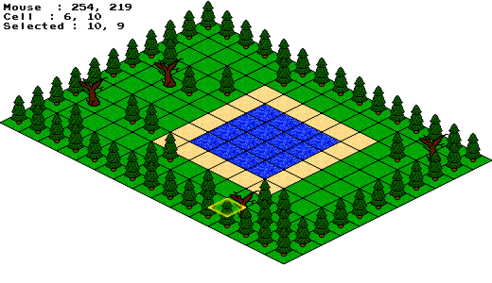
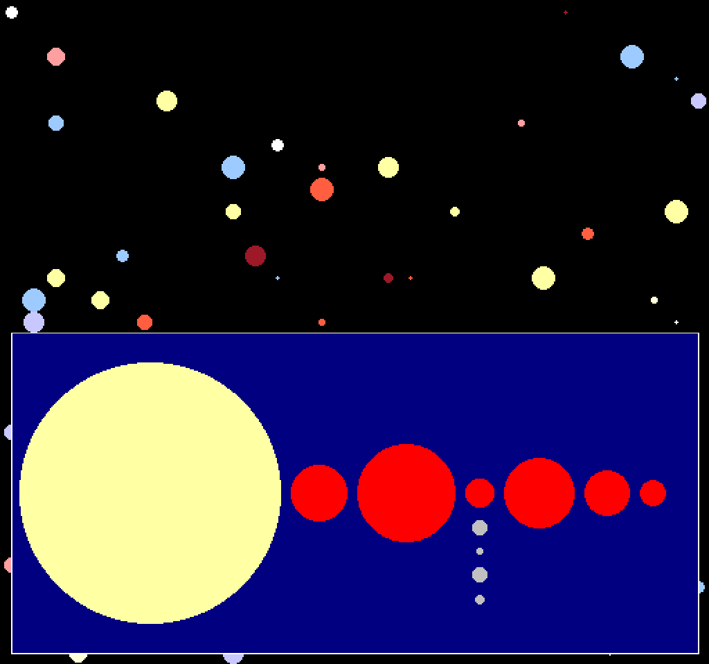

# Graphical Stuff

This is the place of rest for some codes inspired by [javidx9](https://www.youtube.com/channel/UC-yuWVUplUJZvieEligKBkA) using the [olcConsoleGameEngine](https://github.com/OneLoneCoder/videos/blob/master/olcConsoleGameEngineSDL.h) and [olcPixelGameEngine](https://github.com/OneLoneCoder/olcPixelGameEngine/blob/master/olcPixelGameEngine.h).

## Compiling

To compile any CPP code here available on unix based systems, simply do:

```console
user@computer:~/graphical_stuff$ make source_file
```

## [Maze Generator](./proj_rederer/mazeGenerator.cpp)

Generates a maze.


## [Cube Mesh](./proj_rederer/cubeMesh.cpp)

Renders a simple cube.


## [Render Obj File](./proj_rederer/renderObjFile.cpp)

Takes as input a blender *.obj* file and render it to the screen.


## [Terrain Rendering](./proj_rederer/terrainRendering.cpp)

Renders a mountain scene and allows the user to look around.


## [Isometric Tiles](./proj_isometric_tiles/isometric_tiles.cpp)

Interactive isometric grid.



## [Universe](./proj_universe/universe.cpp)

Procedurally generated universe simulator.


