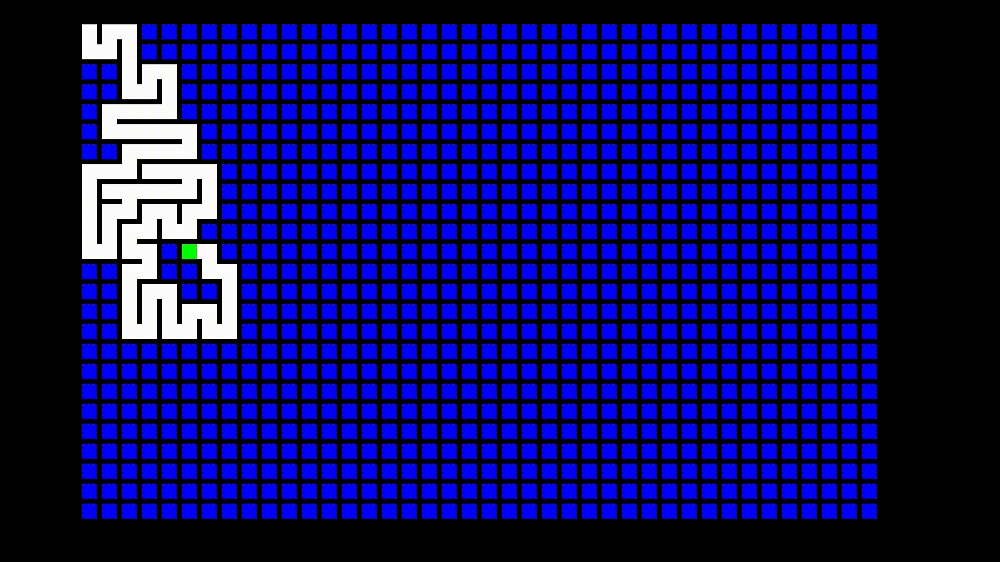

# 3DStuff

Here live some 3D rendering codes inspired by [javidx9](https://www.youtube.com/channel/UC-yuWVUplUJZvieEligKBkA) and using his [SDL library](https://github.com/OneLoneCoder/videos/blob/master/olcConsoleGameEngineSDL.h).

## Compiling

To compile any CPP code here available on unix based systems, simply do:

```console
user@computer:~/3DStuff$ make file.cpp  
```

## [mazeGenerator](./mazeGenerator.cpp)

Generates a maze.



## [cubeMesh](./cubeMesh.cpp)

Renders a simple cube.


## [renderObjFile](./renderObjFile.cpp)

Takes as input a blender *.obj* file and render it to the screen.


## [terrainRendering](./terrainRendering.cpp)

Renders a mountain scene and allows the user to look around.


